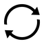

<!-- HEADER (capsule-render) - monochrome -->
<p align="center">
  
</p>

<!-- TAGLINE (typing svg) - monochrome -->
<p align="center">
  
</p>

<!-- GIF (your black-and-white one) -->
<p align="center">
  
</p>


---

<!-- STATS -->
<div align="center">
<table border="0" cellspacing="4" cellpadding="0">
<tr>
<td></td>

<td>
</td>
</tr>
<tr>
<td colspan="2" align="center"></td>
</tr>
</table>
</div>

<!-- Snake Game Repo View -->

<div align="center">
  
</div>

---

<div align="center">

<table>
<tr>

<td width="120" align="center">

</td>

<td align="center">

<pre>
╔══════════════╗
║   Toolkit    ║
╚══════════════╝
</pre>

</td>

<td width="120"></td>

</tr>
</table>

</div>

<p align="center">
  &nbsp;&nbsp;
  &nbsp;&nbsp;
  &nbsp;&nbsp;
  &nbsp;&nbsp;
  &nbsp;&nbsp;
  &nbsp;&nbsp;
  &nbsp;&nbsp;
  
</p>

---

<div align="center">
<table border="0" cellspacing="0" cellpadding="0"><tr>
<td width="50" align="right" valign="middle"></td>
<td width="12"></td>
<td valign="middle"><pre>
╔═══════════════════════╗
║       About.txt       ║
╚═══════════════════════╝
</pre></td>
<td width="62"></td>
</tr></table>
</div>

𝚃𝚑𝚒𝚗𝚐𝚜 𝚝𝚑𝚊𝚝 𝚋𝚛𝚎𝚊𝚔 𝚏𝚊𝚜𝚌𝚒𝚗𝚊𝚝𝚎 𝚖𝚎. 𝙸 𝚝𝚛𝚊𝚌𝚎 𝚊 𝚌𝚛𝚊𝚜𝚑 𝚍𝚘𝚠𝚗 𝚝𝚑𝚛𝚘𝚞𝚐𝚑 𝚖𝚎𝚖𝚘𝚛𝚢 𝚊𝚗𝚍 𝚛𝚎𝚐𝚒𝚜𝚝𝚎𝚛𝚜 𝚞𝚗𝚝𝚒𝚕 𝚒𝚝 𝚌𝚘𝚗𝚏𝚎𝚜𝚜𝚎𝚜 𝚠𝚑𝚢 𝚒𝚝 𝚑𝚊𝚙𝚙𝚎𝚗𝚎𝚍, 𝚝𝚑𝚎𝚗 𝙸 𝚖𝚊𝚔𝚎 𝚒𝚝 𝚑𝚊𝚙𝚙𝚎𝚗 𝚊𝚐𝚊𝚒𝚗.

𝚄𝚗𝚍𝚎𝚛𝚜𝚝𝚊𝚗𝚍𝚒𝚗𝚐 𝚟𝚞𝚕𝚗𝚎𝚛𝚊𝚋𝚒𝚕𝚒𝚝𝚒𝚎𝚜  →  𝙱𝚞𝚒𝚕𝚍𝚒𝚗𝚐 𝚎𝚡𝚙𝚕𝚘𝚒𝚝𝚜  →  𝙽𝚎𝚠 𝚊𝚝𝚝𝚊𝚌𝚔 𝚜𝚞𝚛𝚏𝚊𝚌𝚎𝚜

---

<div align="center">
<table border="0" cellspacing="0" cellpadding="0"><tr>
<td width="50" align="right" valign="middle"></td>
<td width="12"></td>
<td valign="middle"><pre>
╔═══════════════════════╗
║        Skills         ║
╚═══════════════════════╝
</pre></td>
<td width="62"></td>
</tr></table>
</div>

### 𝙱𝚒𝚗𝚊𝚛𝚢 𝙴𝚡𝚙𝚕𝚘𝚒𝚝𝚊𝚝𝚒𝚘𝚗
- 𝚂𝚝𝚊𝚌𝚔 𝚘𝚟𝚎𝚛𝚏𝚕𝚘𝚠𝚜, 𝚘𝚏𝚏𝚜𝚎𝚝 𝚍𝚒𝚜𝚌𝚘𝚟𝚎𝚛𝚢, 𝙴𝙸𝙿/𝚁𝙸𝙿 𝚌𝚘𝚗𝚝𝚛𝚘𝚕
- 𝙲𝚘𝚗𝚝𝚛𝚘𝚕-𝚏𝚕𝚘𝚠 𝚑𝚒𝚓𝚊𝚌𝚔𝚒𝚗𝚐; 𝙶𝙳𝙱 + 𝚙𝚠𝚗𝚍𝚋𝚐
- 𝚃𝚛𝚊𝚗𝚜𝚒𝚝𝚒𝚘𝚗𝚒𝚗𝚐 𝟹𝟸-𝚋𝚒𝚝 → 𝟼𝟺-𝚋𝚒𝚝

### 𝙼𝚊𝚕𝚠𝚊𝚛𝚎 𝙰𝚗𝚊𝚕𝚢𝚜𝚒𝚜
- 𝚂𝚝𝚊𝚝𝚒𝚌 + 𝚍𝚢𝚗𝚊𝚖𝚒𝚌 𝚊𝚗𝚊𝚕𝚢𝚜𝚒𝚜 𝚘𝚏 𝚛𝚎𝚊𝚕 𝚛𝚊𝚗𝚜𝚘𝚖𝚠𝚊𝚛𝚎 (𝚆𝚊𝚗𝚗𝚊𝙲𝚛𝚢)
- 𝙴𝚡𝚎𝚌𝚞𝚝𝚒𝚘𝚗 𝚏𝚕𝚘𝚠, 𝙲𝟸 𝚋𝚎𝚑𝚊𝚟𝚒𝚘𝚛, 𝚎𝚗𝚌𝚛𝚢𝚙𝚝𝚒𝚘𝚗 𝚛𝚘𝚞𝚝𝚒𝚗𝚎𝚜

### 𝚁𝚎𝚟𝚎𝚛𝚜𝚎 𝙴𝚗𝚐𝚒𝚗𝚎𝚎𝚛𝚒𝚗𝚐
- 𝙶𝚑𝚒𝚍𝚛𝚊: 𝚏𝚞𝚗𝚌𝚝𝚒𝚘𝚗 & 𝙲𝙵𝙶 𝚛𝚎𝚌𝚘𝚟𝚎𝚛𝚢
- 𝙳𝚢𝚗𝚊𝚖𝚒𝚌 𝚊𝚗𝚊𝚕𝚢𝚜𝚒𝚜: 𝚋𝚛𝚎𝚊𝚔𝚙𝚘𝚒𝚗𝚝𝚜, 𝚝𝚛𝚊𝚌𝚒𝚗𝚐, 𝚖𝚎𝚖𝚘𝚛𝚢 𝚒𝚗𝚜𝚙𝚎𝚌𝚝𝚒𝚘𝚗

### 𝚅𝚞𝚕𝚗𝚎𝚛𝚊𝚋𝚒𝚕𝚒𝚝𝚢 𝚁𝚎𝚜𝚎𝚊𝚛𝚌𝚑
- 𝚁𝚘𝚘𝚝-𝚌𝚊𝚞𝚜𝚎 𝚊𝚗𝚊𝚕𝚢𝚜𝚒𝚜
- 𝙴𝚡𝚙𝚕𝚘𝚒𝚝-𝚠𝚛𝚒𝚝𝚎𝚞𝚙 𝚜𝚝𝚞𝚍𝚢, 𝚙𝚊𝚝𝚝𝚎𝚛𝚗 𝚛𝚎𝚌𝚘𝚐𝚗𝚒𝚝𝚒𝚘𝚗

---

<div align="center">
<table border="0" cellspacing="0" cellpadding="0"><tr>
<td width="50" align="right" valign="middle"></td>
<td width="12"></td>
<td valign="middle"><pre>
╔═══════════════════════╗
║       Workflow        ║
╚═══════════════════════╝
</pre></td>
<td width="62"></td>
</tr></table>
</div>

```
#!/bin/bash
# QQQ's Exploit Development Workflow

steps=(
  "01_RECON    → Map the target surface"
  "02_ANALYSIS → Understand the binary"
  "03_DEBUG    → Find the crash point"
  "04_EXPLOIT  → Build reliable control"
  "05_DOCUMENT → Write it up properly"
)

for step in "${steps[@]}"; do
  echo "[+] $step"
  sleep 0.5
done

echo "[*] Repeat until root."
```

---

<div align="center">
<table border="0" cellspacing="0" cellpadding="0"><tr>
<td width="50" align="right" valign="middle"></td>
<td width="12"></td>
<td valign="middle"><pre>
╔═══════════════════════╗
║       Projects        ║
╚═══════════════════════╝
</pre></td>
<td width="62"></td>
</tr></table>
</div>

```
.
├── Binary-Exploitation-CTFs/  # picoCTF, HTB, pwn.college, ROP Emporium
│   └── picoCTF/               # Easy / Medium / Hard, fully documented
│
├── Cyber-in-Somali/           # exploit-dev education, in Somali
│   └── Core-Concepts/         # arch, memory, C, assembly, buffer overflow
│
└── Malware-Analysis/
    └── WannaCry-Ransomware/   # full static + dynamic analysis, 23 evidence files
```

> 𝙲𝚢𝚋𝚎𝚛-𝚒𝚗-𝚂𝚘𝚖𝚊𝚕𝚒: 𝚏𝚘𝚛 𝚂𝚘𝚖𝚊𝚕𝚒 𝚜𝚙𝚎𝚊𝚔𝚎𝚛𝚜 𝚜𝚝𝚎𝚙𝚙𝚒𝚗𝚐 𝚒𝚗𝚝𝚘 𝚎𝚡𝚙𝚕𝚘𝚒𝚝 𝚍𝚎𝚟𝚎𝚕𝚘𝚙𝚖𝚎𝚗𝚝. 𝙺𝚗𝚘𝚠𝚕𝚎𝚍𝚐𝚎 𝚜𝚑𝚘𝚞𝚕𝚍𝚗'𝚝 𝚑𝚊𝚟𝚎 𝚊 𝚕𝚊𝚗𝚐𝚞𝚊𝚐𝚎 𝚋𝚊𝚛𝚛𝚒𝚎𝚛.

---

<div align="center">
<table border="0" cellspacing="0" cellpadding="0"><tr>
<td width="50" align="right" valign="middle"></td>
<td width="12"></td>
<td valign="middle"><pre>
╔═══════════════════════╗
║   Currently vs Next   ║
╚═══════════════════════╝
</pre></td>
<td width="62"></td>
</tr></table>
</div>

**// 𝙲𝚞𝚛𝚛𝚎𝚗𝚝𝚕𝚢 𝚞𝚙 𝚝𝚘**
- 𝐬𝐨𝐥𝐯𝐢𝐧𝐠 𝐛𝐢𝐧𝐚𝐫𝐲 𝐞𝐱𝐩𝐥𝐨𝐢𝐭𝐚𝐭𝐢𝐨𝐧 𝐂𝐓𝐅𝐬 𝐚𝐜𝐫𝐨𝐬𝐬 𝐩𝐥𝐚𝐭𝐟𝐨𝐫𝐦𝐬 (𝐩𝐢𝐜𝐨𝐂𝐓𝐅, 𝐇𝐓𝐁, 𝐩𝐰𝐧.𝐜𝐨𝐥𝐥𝐞𝐠𝐞, 𝐑𝐎𝐏 𝐄𝐦𝐩𝐨𝐫𝐢𝐮𝐦)
- 𝐛𝐮𝐢𝐥𝐝𝐢𝐧𝐠 𝐨𝐮𝐭 𝐂𝐲𝐛𝐞𝐫-𝐢𝐧-𝐒𝐨𝐦𝐚𝐥𝐢 𝐟𝐨𝐫 𝐭𝐡𝐞 𝐧𝐞𝐱𝐭 𝐰𝐚𝐯𝐞 𝐨𝐟 𝐒𝐨𝐦𝐚𝐥𝐢 𝐞𝐱𝐩𝐥𝐨𝐢𝐭 𝐝𝐞𝐯𝐞𝐥𝐨𝐩𝐞𝐫𝐬
- 𝐜𝐨𝐧𝐭𝐫𝐢𝐛𝐮𝐭𝐢𝐧𝐠 𝐭𝐨 𝐭𝐡𝐞 𝐜𝐨𝐦𝐦𝐮𝐧𝐢𝐭𝐲: 𝐨𝐩𝐞𝐧 𝐰𝐫𝐢𝐭𝐞𝐮𝐩𝐬, 𝐧𝐨𝐭𝐞𝐬, 𝐚𝐧𝐝 𝐫𝐞𝐬𝐨𝐮𝐫𝐜𝐞𝐬 𝐨𝐭𝐡𝐞𝐫𝐬 𝐜𝐚𝐧 𝐥𝐞𝐚𝐫𝐧 𝐟𝐫𝐨𝐦

**// 𝙿𝚕𝚊𝚗𝚗𝚒𝚗𝚐 𝚏𝚘𝚛 𝚝𝚑𝚎 𝚏𝚞𝚝𝚞𝚛𝚎**
- 𝐰𝐫𝐢𝐭𝐢𝐧𝐠 𝐦𝐲 𝐨𝐰𝐧 𝐯𝐮𝐥𝐧𝐞𝐫𝐚𝐛𝐥𝐞 𝐛𝐢𝐧𝐚𝐫𝐢𝐞𝐬 𝐬𝐨 𝐨𝐭𝐡𝐞𝐫𝐬 𝐜𝐚𝐧 𝐥𝐞𝐚𝐫𝐧 𝐛𝐢𝐧𝐚𝐫𝐲 𝐞𝐱𝐩𝐥𝐨𝐢𝐭𝐚𝐭𝐢𝐨𝐧 𝐡𝐚𝐧𝐝𝐬-𝐨𝐧
- 𝐭𝐮𝐫𝐧𝐢𝐧𝐠 𝐞𝐱𝐩𝐥𝐨𝐢𝐭𝐚𝐭𝐢𝐨𝐧 𝐩𝐫𝐚𝐜𝐭𝐢𝐜𝐞 𝐢𝐧𝐭𝐨 𝐬𝐨𝐦𝐞𝐭𝐡𝐢𝐧𝐠 𝐩𝐞𝐨𝐩𝐥𝐞 𝐚𝐜𝐭𝐮𝐚𝐥𝐥𝐲 𝐞𝐧𝐣𝐨𝐲


